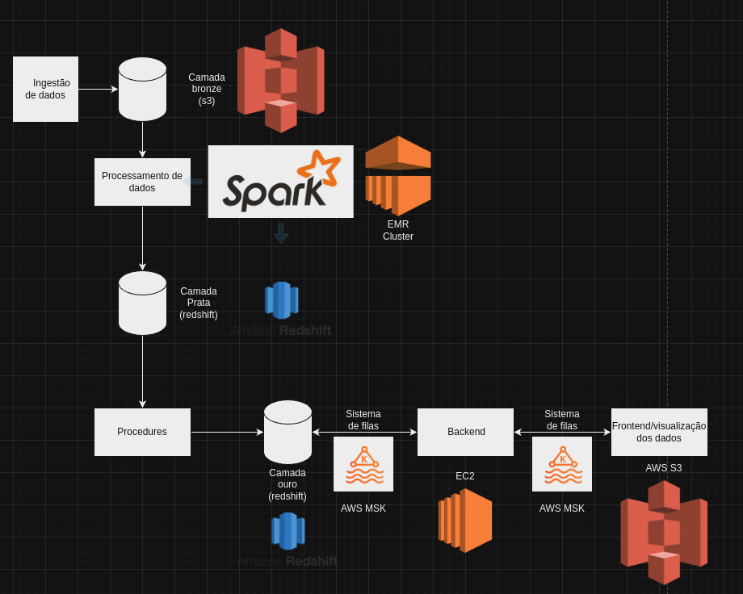

# ProvaM11

# Documentação da Arquitetura de Dados para Streaming de Mídia

## Visão Geral

 </img>

A solução proposta oferece uma arquitetura que tem um sistema de armazenamento de dados multiregional, com a capacidade de processar os dados em tempo real, garante a conformidade e segurança com os dados de acordo com as regulamentações de proteção de dados, escalavel, flexivel, dispõe de um sistema integrado e tambem dispoe de um sistema de orquestração na parte de processamento de dados

## Componentes da Arquitetura

Descrição dos principais componentes da arquitetura e suas funções:

AWS S3(Camada Bronze) - Camada bronze da estrutura medalhão, é para onde os dados coletados são enviados

EMR CLUSTER - Responsavel por fazer o processamento dos dados do S3(camada bronze) para o Redshift(camada prata)

AWS REDSHIFT - Armazenar os dados, sendo tanto a camada prata como a ouro da estrutura medalhão, o Redshift é responsavel por receber os dados processados do spark e fazer a modelagem final dos dados para ele serem consumidos pelo Backend(EC2)

AWS MSK - Responsavel por fazer a orquestração do processamento e envio de dados do backend, usando do apache kafka

AWS EC2 - Responsavel por garantir que nosso backend seja escalavel e flexivel

AWS S3(frontend) - Responsavel por disponibilizar os dados de forma visual para o usuario final

### Armazenamento de Dados

Primeiramente os dados são armazenados na camada bronze em um bucket S3 que oferce vantagens para o acesso rápido usando de sua distribuição geografica que disponibiliza a criação de buckets em diferentes regiões tornando os dados mais acessíveis assim minimizando a latência, em seguida apos os dados serem tratados armazenamos os dados no redshit.

### Processamento de Dados

Os dados são processados da camada bronze para a prata por meio de um EMR Cluster responsavel por rodar o spark que é uma ferramenta feita para processar uma grande quantidade de dados.

Na camada prata para a camada ouro fazemos o processamento dentro do banco de dados, usando de comandos sql para que consigamos ter o banco modelado para que o backend possa usar desses dados

### Segurança e Conformidade

Por conta da AWS ser uma empresa mundial, conseguimos usar de suas maquinas em diversas geolocalizações, garantindo que os dados sejam armazenados nos devidos paises. Outro ponto é que os serviços da AWS já oferecem questões de segurança e integridade aos dados

### Escalabilidade e Flexibilidade

A arquitetura dispões de escalabilidade pois é possivel usar de ferramentas da AWS para que nossas maquinas e ferramentas usadas sejam escaladas de forma vertical ou horizontal de forma automatica.

E garantimos a flexibilidade pois por termos um processo bem definido desde a ingestão até a visualização dos dados caso seja decidido integrar novas tecnologias é facil fazer a integração.

### Integração de Serviços

Novos serviços podem ser integrados pelo meio que for definido como o melhor, bastando apenas atualizar a esteira do processamento até a visualização dos dados, então caso seja nescessario adiconar mais uma etapa de basta atualizar as conexões das duas pontas e colocar a tecnologia ou serviço no meio do processo.

Na questão de orquestração tudo pode ser feito pelo proprio console da AWS.
